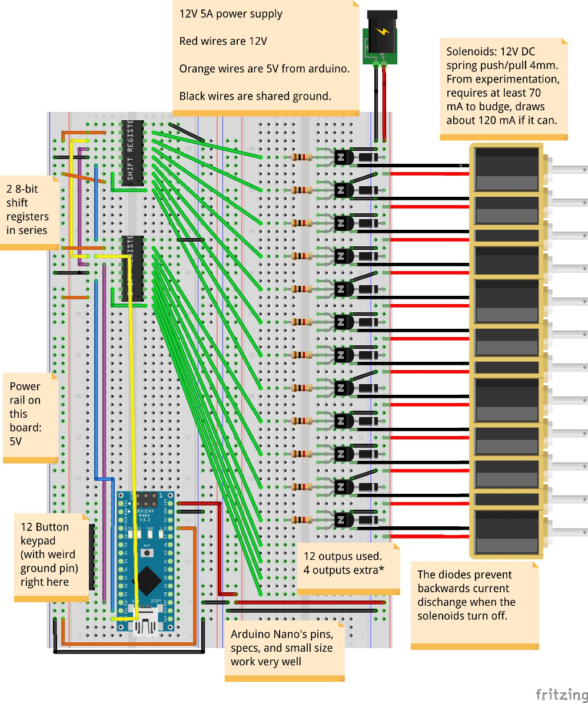

## Summary

This site details an ongoing project to improve the chord selection mechanism on chromatic Autoharps/Chromaharps (hereafter called just "autoharps"). An arduino reads inputs from a keypad, computes the desired chord from the keypresses, and mechanically dampens the undesired strings.

It does **not** strum or pluck for the human, nor does it change chords without human input.

See [Motivations](#motivation) for why this project is useful.

See [Dampening Mechanism](#dampening-mechanism) for an for detailed analysis of dampening mechanism possibilities.

See [Avoiding harmonic nodes](#avoiding-harmonic-nodes) on the importance of considering harmonics when experimenting.

See [Keypad → Notes logic](#keypad--notes-logic) for more discussion than you wanted about sensible chord setups.

See [Wiring and Components](#wiring-and-components) to see how and with what it can be constructed.

--------

## Motivation
#### Autoharps are limited in number/variety of chords

Most autoharps have between 12 and 21 chord bars, with the ability to play in only some of the 12 musical keys. The chords available are usually major chords, minor chords, major-minor 7 chords, and sometimes a diminished chord.

Thinking just about these 4 types of chords, the maximal manual autoharp can play 21 of them, out of the `12*4=48` possible.

Stepping out of the chord bar paradigm can allow more flexibility.

#### Ergonomics of chord layouts can only go so far, and are not always key agnostic

The best layout I've found with 21 bars is to have each column be of the form (from farthest reach with the left hard to closest): `(Am, C, A7)`. Successive columns just walk this around the circle of fifths. This makes playing most major and minor songs in 5 key signatures ergonomic and *key agnostic* (transposing a song is as simple as shifting your chording hand over). Still, one of several flaws with this layout: When one wants the major/minor version of the minor/major chord, it's a wide reach that may go off the harp.

Stepping out of the 1 button = 1 chord paradigm can allow more flexibility.

#### Playing autoharps for long periods can cause cramping, arthritis, or other joint pain in the chording hand.

Depending on how well tuned the harp is and how the hand is positioned, this may be more or less of an issue. I don't play for more than an hour at a time, due to cramping.

Stepping out of the finger-force dampening paradigm etc.

----------

## Dampening mechanism

3 possibilities for this:

#### One solenoid per string

This is my current pursuit. Every string has a small solenoid positioned so that the unpowered state is dampening the string. When powered, the dampener lifts up, allowing that string to sound. The arduino controls the 30-40 solenoids individually, allowing more flexibility than the other two solutions. Cheap solenoids will cost around $1. The batteries I've tried cannot deliver the amps needed, so I'm trying a 12V, 5A laptop charger for now.

**Construction summary**: From a autoharp with exposed chord bars. Remove all bars except for one. Stretch the springs holding that bar so that the bar stays high under more force. Super glue solenoids to the sides of the bar such that the solenoids head is just short of touching the string it should dampen. Padding can then be glued to the head of the solenoid so that the resting state dampens the string effectively. Alternate placing solenoids on each side of the bar to give them enough lateral space.

**Considerations**: Size, shape, material of the dampening pads. Force of dampening. Lower notes' pads need more contact with the string to effectively dampen.

**Pros**: String by string flexibility for chord building, simple construction

**Cons**: Raised solenoids (undampened strings) draw current while remaining raised (one of my tiny $1 solenoids needs at least 70 mA to start lifting, and will continue to draw that while raised).

**Edit 01/13/2020**: On the second build iteration, I found solutions to the energy usage issues.

First, using a [voltage regulator](https://www.amazon.com/DROK-Converter-5-3V-32V-Regulator-Transformer/dp/B078Q1624B/), I was able to reduce the voltage to 9.5 or 10 volts, which reduces current through each solenoid. Each solenoid now needs about 140mA to raise.

Second, one of the solenoids only needs a tiny fraction of that power to stay raised, so the arduino can regulate down the power after a short time, greatly reducing energy costs.

This was a big problem to solve: It makes the prospect of raising all solenoids at once manageable, battery solutions are far more feasible, and the solenoids and components don't get super hot anymore!

#### Depress single-note bars with motor push

This is the second simplest solution. There are 12 "chord" bars, but their felts are cut so that one dampens only the `C`s, one dampens only the `C#`s, etc. Now to form an arbitrary chord, press down the set of bars that correspond to the pitch classes you **don't** want in the chord. Each depression will probably require more force than small solenoids can probably supply, so higher torque stepper motors may be better.

**Construction summary**: From an autoharp with exposed chord bars, take 12 bars and cut their felts to only dampen one pitch class. Replace them in a way to avoid damping on harmonic nodes. Get 12 high torque stepper motors with arms that swivel to straight down (to depress a bar). Mount them above the bars somehow, taking into account their difficult dimensions and the point of downward force on the bar relative to the strings being dampened. Given my lack of construction experience, this last task was too daunting for me.

**Considerations**: Force of dampening. Avoiding harmonic nodes.

**Pros**: Minimal power usage when not changing chords. May be cheaper than the solenoids if done effectively.

**Cons**: Complicated mounting that occupies space in front of chord bars, which may get in the way of the strumming hand.

#### Depress single-note bars with down pulling strings

I only mention this because I seriously tried making it work for a bit. Wouldn't recommend it.

Like the above in terms of the single note bars. For each bar: Tie a string to each end, run it straight downward and around a pivot point, then pull on both ends to depress the bar. Use a motor head to pull the strings taut to dampen a note.

**Considerations**: Allowing the motors to do no work when not changing chords. Motors need to have some torque.

**Pros**: The complicated mounting of the previous can be relocated somewhere less invasive (inside the autoharp body would be really interesting.

**Cons**: Starting to get quite complicated.

--------

## Avoiding harmonic nodes

See the [Wikipedia article](https://en.wikipedia.org/wiki/Harmonic) if you don't know what a harmonic node is. To experience it, place your finger or an eraser exactly halfway along a string, and pluck the string. An octave above the string's note will resonate. Slide along the string to find other points where the string will still sound.

That point on the string is a harmonic node, and is a poor location for a felt to dampen sound. There are other harmonic nodes at `(1/3, 2/3, 1/4, 3/4, 1/5, 2/5, ...)` etc. (all the rational numbers between 0 and 1). As the denominator gets bigger, it matters less in this context.

Whenever we mess with positions of bars and felts on the autoharp, we need to keep this consideration a priority to minimize extraneous noise while strumming. Consider marking all the harmonic nodes on the strings (e.g. with a red marker) before deciding on bar/felt placements that avoid those spots.

-------------

## Keypad &rarr; Notes logic

***Edit 01/13/2020***: If you don't care about motivations and thought processes, skip all this (very interesting) stuff past self wrote. I'll cover my current favorite keypad layout in [On Second Construction](#on-second-construction). That said, I still basically agree with all of this, past self just overlooked a few possibilities and didn't have enough buttons to press.

This project has the opportunity for a very consistent, learnable, ergonomic, key agnostic chord control mechanism. Optimizing for all these is a real puzzle, and different musicians will have different opinions and desires in this area.

Thankfully, the code on the arduino is far more easily changed than the mechanics of the construction, so we don't have to build a new autoharp if we forget a chord.

In this section, there will be tension between 1) incorporating more buttons/controls/physical complexity into the design, so that the amount of interaction needed to change to arbitrary chords is minimized, and 2) having fewer buttons/controls, so that the size/cost/physical complexity is minimized, but more interaction is needed to specify arbitrary chords. Each person probably has their own balance, but I lean more toward the fewer buttons/controls because I'm bad at electronics.

#### Music Theory Considerations for important triads

In a major key, here are the roman numeral chords I want easy access to, in decreasing order of importance: `(I, V(7), IV, vi, ii, II(7), iii, III(7), vii°, VI, VIIb, ...)`  I have high uncertainty after halfway through that list.

Similarly, in a minor key (using the roman numeral `vi` as the tonic chord for consistency): `(vi, iii, III(7), ii, V(7), I, IV, ...)` I have high enough uncertainty that I won't try to add more.

Songs with the richest harmonies have both minor and major progressions in them, so it behooves us to not only make the system key agnostic, but also *tonality agnostic* (a term I just made up: a song that starts major and then goes minor or vice versa shouldn't throw us for a loop).

The first 7 elements of each list have 6 in common, which (probably due to some arcane property of (meta-)music-theory) are also six-in-a-row around the circle of fifths: `(IV, I, V, ii, vi, iii)`.

Or, arranging them in rows as autoharpists typically do:

|     |     |     |
| --- | --- | --- |
| IV  | I   | V   |
| ii  | vi  | iii |

This seems like an optimal arrangement of 6 buttons for playing diatonically, to be key and tonality agnostic. I'll treat these 6 chords as the core chords, which should be accessible through a single button press.

To actually make it key agnostic though, there needs to be a way to play in more than one key.

**Fixed chord root buttons**: We could do this with static buttons by having 24 buttons that we could arrange in 2 literal circles of fifths. The circles could be one inside the other, and then we literally have a circle of fifths as a control board:

24 buttons feels like a lot, but it gives us every major/minor triad, and it could make for a really attractive circular keypad, which could rotate to "switch" keys, and have modifier keys inside or outside the main circle. You would have to construct this yourself, as I can't find such a circular keypad online, even just for one row.

If your thumb is used to joysticks, another idea is to map the sectors of a joystick's movement to the circle of fifths. The lack of tactile feedback on the boundaries between chords, or the small 30&deg; sectors might be issues.

**Dynamic chord root buttons**: We can try to use program state to do it with fewer buttons: 6 buttons could code for `(IV, I, V, ii, vi, iii)` as in the table above, and 2 buttons could be used to change our key. Each button can change the key one direction or another around the circle of fifths. This has the disadvantage of not being able to jump to some arbitrary chord root outside the key: `VIIb` and `VIb` come to mind as somewhat common examples. And the chord `vii°` is entirely in the key and we can't reach it either.

The biggest problem is that the II and III chords aren't there. Adding another row can fix that, and also gives us all of the first 7 most important chords in major and minor from above:

|     |     |     |
| --- | --- | --- |
| IV  | I   | V   |
| ii  | vi  | iii |
| II  | VI  | III |

This third row looks a little redundant next to the second row; especially if the "Swapping major/minor triad" modifier below is convenient to use.

#### Music Theory considerations for chord modifiers

We can expand the possibilities of these chords with modifiers. A modifier is a way to add or modify the notes in the 24 basic triads. Ideally, several modifiers could be added to one triad without much hassle. Each player will probably have a different preference for how these are arranged and which are included, or may even desire to change layouts between songs.

Here's my list of modifiers in decreasing order of importance and increasing order of my excitement: Adding a minor seventh, switching major/minor to minor/major triad respectively, diminishing the chord, sus4-ing the chord (!!), adding a major seventh to the chord (!!!), augmenting the chord (!!!!). There could be add2, add6, 9, 11, 13 stuff as well.

**Adding sevenths**: The major point of contention with having a `+7` modifier button is whether that 7 should be major or minor or context dependent. Chords with a major 7th above the root are rare, and seldom used outside of jazz. [Mechanical autoharps aren't great for jazz](http://jazzmando.com/new/archives/001511.shtml) (Only view if you aren't easily offended), and the possibility for major sevenths would help.

It isn't usually possible to predict the presence of major sevenths from the key signature, and chord sheets are explicit about when the 7 is major: `FM7` or `Fmaj7`. For this reason, it seems most best to use two separate modifiers: A `+min7` button that is in very easy reach for frequent use, and a `+maj7` button if the player wants it.

Alternatively, consider that a single button could be double tapped to get a different behavior, e.g. `+7` once for `+min7` and twice for `+maj7`.

**Swapping major/minor triads**: A `ii` becomes a `II`. A `iii` becomes a `III`. A common progression at the end of songs: `(I - iv - I)`. The `IV` and `V` in a major key get swapped out with their parallel minor counterparts for a more edgy harmony. The [Picardy third](https://en.wikipedia.org/wiki/Picardy_third) makes the last chord of a minor song (un)expectedly major.

Though a minor button and a major button separately are simpler to understand, the minor button would only be useful on major chords, and the major button only on minor chords. Combining them into a single button saves a button for something else.

**Diminished chords**: Three chords of interest: a [diminished triad](https://en.wikipedia.org/wiki/Diminished_triad) (3 notes with minor thirds between them), [fully diminished seventh chord] (https://en.wikipedia.org/wiki/Diminished_seventh_chord) (4 notes with minor thirds between them), and [half-diminished seventh chord](https://en.wikipedia.org/wiki/Half-diminished_seventh_chord) (a diminished triad with a minor seventh on top). The logic I've used thus far does not fit diminished chords well: We don't have `vii°` the most common diminished triad in our base triads; if we did, we still don't have a modifier to add a minor sixth to the chord for the fully diminished seventh. The most comprehensible solution is simply to add a modifier for each variation.

There are a few inelegant hacks we can use if we don't want to add so many buttons for these relatively rare chords. We could add one modifier button, a `dim` button, but have the button work in coordination with our `V` triad to produce the `vii°`. Why `V`? The diminished triad has a (dominant function)[https://en.wikipedia.org/wiki/Dominant_(music)] just like the `V`, and a `V7` can be thought of as a `vii°` with an added fifth scale degree.

We can co-opt other buttons that will not be much use in diminished chords, such as the `+maj7`, to be a `+min6` for the fully diminished chord. We can use the `+min7` as is to produce a half-diminished chord. Each of these chords would require 3 button presses: the `V`, the `dim`, and whichever `+7` button.

**Augmented chords**: These are a piece of proverbial cake relative to the diminished chords. An [augmented triad](https://en.wikipedia.org/wiki/Augmented_triad) is 3 notes separated by major thirds. Ignoring enharmonics (as I do) there are only 3 different augmented chords. So throw on an `aug` button, hit it with `I` or `iii` and you'll get the same effect. The `+7` modifiers are still there if you want to play a really exotic chord.

**Sus4 chords**: In a [sus4 chord](https://en.wikipedia.org/wiki/Suspended_chord) the 3rd is removed and a perfect 4th added. Pretty straightforward unless you want to hack together a more general system to get `sus2` without extra buttons, but I'm cool with just a `sus4` for now.

**You get the idea**: Other modifier ideas: removing the third to make open fifths, removing third and fifth to make octaves (yawn). "Scale" modifiers could be used for allowing playing any notes inside the scale by damping the ones outside the scale. Diatonic scale, pentatonic scale, various minor scales, or other less common scales.

#### Misc. operator buttons

**Left/Right around the circle of fifths**: 2 buttons, `mod5` and `mod4` to allow the instrument to change keys in two directions: `V` becomes `I`; and `IV` becomes `I`. Modulating by minor thirds might also be useful to go quickly between parallel major/minor keys.

**Previous chord**: There are frequently times when you are walking a melody up a scale and have to go back and forth between passing chords. Having a `prev` button to go to the chord just before the one currently playing could save 1 or 2 key presses depending on how complicated the chords are.

#### Keypress timing considerations

Timing is very important and has not yet been discussed. Some keypads do not support detecting multiple keys pressed at the same time, so combinations of keys pressed to produce a chord cannot happen at once. We will call this a _sequential_ keypad system. Many more keypads have, at least in their hardware, the ability to correctly detect certain simultaneous keypresses, but not others. We'll call a system that can detect some number of simultaneous keypresses correctly a _simultaneous_ keypad system. We'll start with thinking sequentially for simplicity's sake.

#### Sequential principles

Most of the time when you press the `IV` button, you just want to play that chord as is. But suppose one time in the middle of a song it's a minor `iv` chord, requiring the major/minor modifier plus the `IV` button. Thinking sequentially, one button press has to come before the other.

If the `IV` is first, the arduino can either 1) wait for more input, or 2) immediately make the chord available with possibly the wrong tonality.

If the `maj/min` is first, the arduino can either 3) wait for more input, or 4) immediately change the current chord to the opposite tonality.

Of these 4 scenarios, I like 3 best. Immediate changes mean the instrument will be in states of the wrong tonality. If the arduino is to wait for something, it's best that the "something" be definite. We've talked about the 6 fundamental triad controls, and one reason they are so fundamental is that they are the common element, and thus can safely be the element that actuates the changing of the chords in one quick motion.

Say we're in C major, and we want to play `E7`, which is `III7`. So the order of the sequential presses would be `maj/min`, `+m7`, `iii`. Only pressing the final button would cause the dampened strings to change. Not gonna lie: this sounds painful given how often I use `III7`.

#### Sequential layout ideas

Given the above, here are some of my ideas for "good" sequential keypad layouts. Any of these could have part or all of it rotated 90&deg; to better fit under the fingers.

**12 button sequential keypad A (fast and simple):**

|     |     |     |
| --- | --- | --- |
| IV  | I   | V   |
| ii  | vi  | iii |
| II7 | VI7 | III7|
| mod4|+min7| mod5|

This layout should play melodies quickly and efficiently. The presence of the third triad row (with 7s already added because of their nearly universal use on secondary dominants) allows us to leave out `maj/min` modifier. We can play most chords with a single keypress, with the exception of the `V7` (this is a real downer). Even with just these 12 buttons, the player can play in all 12 key signatures, major and minor, with the most common chords, have minor chords with minor sevenths, major sevenths if you use a double-tap logic, and modulate keys mid song without fuss. 

Some players might like swapping out the `+min7` for a `V7` button, or have the double tap behavior provide the `V7`, or some variation on that.

**12 button sequential keypad B (slower and deeper):**

|     |     |     |
| --- | --- | --- |
| IV  | I   | V   |
| ii  | vi  | iii |
|+min7|maj/min|sus4|
| mod4|prev | mod5|

We remove our convenience row of chords to add more cool modifiers to show off with. Double taps would open open up more possibilities `+min7`  &rarr; `+maj7`; `maj/min` &rarr; `dim`; `sus4`  &rarr; `sus2`. But here the secondary dominants with sevenths require 3 presses. This could be fine for chording and slower melodies, but not faster ones. The `prev` button recovers some speed between alternating chords.

#### Simultaneous principles in row, column keypads

The possibility of pressing multiple keys at the same time allows for faster fingering of chords with modifiers, but introduces complexities of hardware and timing. For a better introduction to these issues on a typical computer keyboard, [see here](https://en.wikipedia.org/wiki/Rollover_(key)).

**No ground pin**: It's common for keypads to be wired such that each row and column corresponds to a pin, such that pressing the button in the first row and first column connects the first row pin (`row1`) to the first column pin (`col1`). Suppose that the button in the first row, second column is also pressed. then `row1`, `col1`, and `col2` are all connected to each other.

But the arduino's logic is in reverse: (Ex. 1) If it sees that `row2`, `col3`, and `col4` are connected to each other, can it know for certain what buttons are pressed? In this case, yes, because a button press is always at the intersection of a row and column, and a row or column pin can't be in the connected list without having a pressed button. We can extend this logic to say that any number of keypresses in any single row or in any single column are always safely distinguishable.

(Ex. 2) If `row1` and `col1` are connected, and `row2` and `col2` are separately connected, the arduino still knows the exact two buttons that are pressed. This, along with the first example, shows that any two simultaneous keypresses are distinguishable.

Certain combinations of 3 simultaneous keypresses introduce ambiguity. (Ex. 3) If ever there is a pressed button (e.g. `row1, col1`) who has another pressed button buddy in their row (`row1, col2`), and also a pressed button buddy in their column (`row2, col1`), then all the arduino sees is a group of 4 connected pins: `row1`, `row2`, `col1`, `col2`. Some combination of 3 or 4 of these were pressed, but there's no way to know which. 

However, ambiguity is not necessarily a deal-breaker: as long as the arduino has a sensible default for how to interpret specific situations of ambiguity, it can use that default. We just want to avoid designing a system that allows two useful "button signatures" to have the same "pin signature" from the arduino's perspective.

**With ground pin**: My keypad is weird in that it has a pin that connects to every button, which I'll call the `ground`. So pressing the top left button connects `row1`, `col1`, and `ground`. So Ex. 2 isn't a possibility, because all button presses connect the entire set of row and column pins involved. So the only unambiguous button presses are, as descibed in Ex. 1, within a single column or within a single row. The same note about ambiguity applies.

I'm honestly not sure where I got this keypad, or why I would want this `ground` pin when it seems to only decrease the functionality.

**Regardless**, it is safe for us to make plans for simultaneous keypresses in a single row or column. This limitation still allows quite a few possibilities, but makes simultaneous modifier keys, like a `+min7` difficult to put somewhere that is usable by all the relevant chords. As a result, I'll try to avoid having modifier keys at all.

**12 button simultaneous keypad (Bear With Me edition):**

This will get kind of complicated to diagram now. It's better to have lots of choices IMHO, but I realize many will disagree with me. Note that "2 buttons to the left" will sometimes mean wrapping back around to the right side.

**Interpretation:** Default chord (chord when button to the left is also pressed) (chord when the 2 buttons to the left are both pressed)

|     |     |     |     |
| --- | --- | --- | --- |
|  VIIb (vii°) (vii°7) | IV (IV7) (IVmaj7) | I (I7) (Imaj7)  | V (V7) (Vmaj7)   |
| v (iv) (i)  | ii (II7) (ii7) | vi (VI7) (vi7) | iii (III7) (iii7) |
| mod4 | prev | +sus4 | mod5 |

First off, I sincerely apologize for the first column, you may ignore it as you are picking up the pattern of the rest of the table. 

Pressing a bunch of buttons in a row are interpreted as a modifier on the rightmost of the buttons pressed (wrapping from left to right is important, e.g. to get the `vii°` one would press `VIIb` and `V`). This mostly serves to add various sevenths to chords, and differs between the major and minor triads.

**Major**: When 1 button to the left is pressed, it does `+min7`. When 2 buttons are pressed, it `+maj7`s the chord.

**Minor**: When 1 button to the left is pressed, it majors it and does `+min7`. When 2 buttons are pressed, it just `+min7`s the chord. I didn't use `+maj7` because that isn't as much used on minor chords.

And the first column just throws in all the things I would be sad not to have, in a vaguely circle-of-fifths-y way. This layout throws easy comprehension out the window in favor of packing in the options in an ergonomic manner (Imagine alternating between fingerings for `I` and `V7`, just by lifting a single finger, or doing the same between `III7` and `vi`).

Note that on a grounded pin keypad, the `+sus4` introduces ambiguity when pressed simultaneously with, say, `V`. It connects pins `row3`, `col3`, `row1`, and `col4`. However, if we are content with only using `+sus4` with a single other button press, and not using the other buttons in the 3rd row with the triad buttons, we can have the arduino interpret this ambiguity predictably as using the `+sus4` with whichever button is diagonal to it. No-ground-pin keypads don't need to worry about this.

I'm not sure how useful the `prev` button will be in this layout, because most back-and-forth passing chords are pretty easy to go between already. I add it here mostly because I don't know what else to put in that space. I can't have another typical modifier due to the paragraph above. I could have a parallel minor modifier that is only used with the `mod4` and `mod5` buttons to change key up or down by a minor 3rd easily. Or I could put another chord there, like the `VIb`.

## On Second Construction

This section is written much later. On the second construction attempt, I solved a lot of major issues.

I started over building because the first build was cludgy and bad in its
unfinished state. Here are the major changes in the second construction, in
the software:

 - Using 16 button keypad (4 column, 4 row pins, no weird ground pin
 this time ;) This allows:
 - Different button reading strategy: Use two dimensional array of
 button states rather than row and column states. This allows a lot more
 keypresses without ambiguity.
 - Keymapping to chords substantially rethought. Now it doesn't use ANY
 simultaneous keypresses, but considers some keys as "modifiers" which
 don't do anything when pressed on their own, and "actuators" (maybe
 find better name?) which when pressed immediately actuate a chord with
 whatever modifiers are down. See the big comment in the code for the
 layout.
 - The above means that we were able to get rid of the `buffer_chord`
 system entirely! :celebrate:
 - Chords can now have up to 5 notes to allow for things like Dominant 9
 chords. No reason it couldn't be more.
 - Major power reduction by using pin 10 on the arduino to change
 current flowing to the solenoids. The solenoids need lots more power to
 pop up than they need to stay up, so every chord change starts at
 `FULL_POWER` then drops power usage considerably to `LOW_POWER` after
 `TICKS_AT_FULL_POWER` ticks.
 - Pasted in the function `setPwmFrequency` to use on pin 10, because
 the default, slower frequencies cause audible hums during `LOW_POWER`

Major changes in the hardware that weren't mentioned in the software:

 - I'm now soldering female header pin connectors rather than the components themselves into the soldering board. If I fry another Arduino Nano or break a keypad it will be a trivial swap-out rather than a solder-mess project-killer.
 - Similarly, on each solenoid, I'm putting a jumper cable head on one of the wires. This way, it can be plugged in rather than soldered in. Same logic as above, and flexibility of rewiring on the fly if the autoharp strings are tuned to different pitches.
 - I'm now using a [voltage regulator](https://www.amazon.com/DROK-Converter-5-3V-32V-Regulator-Transformer/dp/B078Q1624B/), which helps me fiddle with and monitor power better. It might not be necessary in the long run, but for a prototype it is _incredibly_ handy to simply bump the voltage up or down.
 - I'm not trying to incororate LEDs this time around. Simpler design, more in my pay grade.

### Most recent keypad layout (4x4 buttons)

My new keypad's hardware doesn't have ambiguity unless 3 or more button presses are at the corners of a rectangular area. This allows some clever setup of held (not simultaneous press!) modifier keys. Getting rid of simultinaety is huge I think.

**Single press with single modifier**

|     |     |     |     |
| --- | --- | --- | --- |
| VIIb | IV | I | V |
| ii | vi | iii | vii° |
| _Make Do_ | _Sus2_ | _Sus4_ | _Maj/Min_ |
| _mM7_ | _MM7_ | _mm7_ | _Mm7_ |

**Single press with double modifier in vertical stacks**

|     |     |     |     |
| --- | --- | --- | --- |
| VIIb | IV | I | V |
| ii | vi | iii | vii° |
| _Dim_ | _Aug_ | _Dim7_ | _1/2 Dim 7_ |
| _(^^^)_ | _(^^^)_ | _(^^^)_ | _(^^^)_ |

Note that:

 - The arrows _(^^^)_ mean that both modifiers must be pressed for the listed modifier to apply. Still, nothing will actuate until a chord button is pressed.
 - Because these modifiers are vertically stacked, it is impossible for a single chord button to form a rectangular area, so hardware ambiguity is avoided.

**Single press with double modifier in diagonal combinations**

|     |     |     |     |
| --- | --- | --- | --- |
| VIIb | IV | I | V |
| ii | vi | iii | vii° |
| | | _Dom9_ | |
|  |  |  | _(Dom9)_ |

Note that:

 - I'm not sure how well these combos will work ergonomically, so I'm only trying one for now. _Dom9_ means Root, M3, P5, m7, M9(M2).
 - Once again, these diagonal combinations avoid hardware ambiguity when one of the chord buttons is pressed

**Horizontal Double modifier as chord button:**

|     |     |     |     |
| --- | --- | --- | --- |
| VIIb | IV | I | V |
| ii | vi | iii | vii° |
| | | VIb | (<<<) |
|  |  | IIIb | (<<<) |

 - These horizontally aligned modifiers would NOT work unambiguously with all chord buttons (If the `I` were pressed, it would look like `V` was also pressed), so it seems reasonable to actually make the modifiers actuate in combination with each other. This means that these particular chords can't have modifiers applied to them to make, for example, a VIb seventh chord.
 - Not all slots are used, because most other chords we really want to be able to add other modifiers

 I'll update the Wiring and Components section at some point, it's outdated for now

--------

## Outdated Wiring and Components

3 main topics here, which others have covered pretty well already so I don't need to. Click the links to read more.

1. [8-bit shift registers](https://www.arduino.cc/en/tutorial/ShiftOut): Getting the (at least) 12 outputs necessary to control 12 systems of solenoids independently, without using up all the arduino's pins.

2. [Driving solenoids with an arduino](https://core-electronics.com.au/tutorials/solenoid-control-with-arduino.html): Except that we will drive the solenoids and the arduino off the same power source, so maybe this isn't super relevant.

3. [Keypad input method](https://www.instructables.com/id/Arduino-Button-Tutorial/): having the arduino read in button presses. This is basic input/output stuff, and the linked tutorial is excellent for looking at a single case. I've covered the specific convoluted logic of my keypad already.

Here's my breadboard setup all laid out. This is diagram version 2, using the nano and fixing some wire placement issues from the first version. 

**Disclaimer**: I'm not great at electronics as I write this. I fried several components on my way to what I hope is a safe, working design.

#### Diagram notes

For every one solenoid shown in the diagram, there will be upwards of 4 solenoids wired in parallel with it, so that all the `C` solenoids share a transistor, and so do the `C#` solenoids etc.

The 4 "extra" outputs could be used to wire the 4 bottom strings of the autoharp individually, so that you can have, for example, the `G7` chord not include the bottom `F`, but still include all the other `F`s.

Other than using 12V to power the arduino on the Vin pin, keep the 12V as far away from the arduino as possible. I fried one Nano by momentarily bridging a connection from 12V to the Nano's 5V pin.

#### Outdated Components list

 * I used [this SB1660 busboard](https://www.amazon.com/gp/product/B00LLOOA0U) for soldering a semi-permanent prototype.
 * Arduino Nano
 * 12V, 5A power supply
 * 2 x 74HC595 chip
 * 12-16 x 1kΩ resistors
 * ~36 x [12V 120mA spring push pull solenoids](https://www.ebay.com/itm/12V-DC-Suction-Micro-Electromagnet-Spring-Push-Pull-Type-Rod-Solenoid-Magnet-4mm/153089629798) (You need one for each autoharp string.)
 * 12-16 x 2N2222 (NPN, BJT) transistors
 * 12-16 x 1N4001 diodes

----

## Code

[Here's the code](https://github.com/kenanbit/smart-o-harp/blob/master/code/code.ino). It's fairly straightforward.

